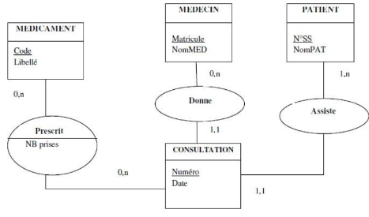

ME Expert IT – Applications Intelligentes et Big Data (1ère année)
# Projet d’expertise évalué : « Projet JEE, Spring, Oracle » : programmation d’un web service REST avec Spring et Oracle

Ressources :
   - SonarQube (qualité) : https://sonarcloud.io/project/overview?id=elbarbarfafa_p-jee-s-o
   - Documentation API (openapi + swagger) : http://localhost:1350/swagger-ui/index.html#/

Spécifications

Construire une API REST basée sur Spring : Framework v6, Boot v3, Web, Data JPA et Security
Cette api pourra se connecter à une base de données Oracle XE ou MariaDB via une modification de la configuration.

1) Définir une structure de projet Java Spring (dernière version)
1) Traduire le MCD suivant en entités mappées avec des tables en base de données via des annotations JPA :

   

1) Définir les contrôleurs REST permettant de :
   - Se connecter à l’API via login/pwd et récupérer un jeton JWT
   - Récupérer l’ensemble des patients avec pagination et une recherche optionnelle sur le nom ou le numéro de sécurité sociale.
   - Lister avec pagination l’ensemble des médecins, recherche optionnelle sur le nom ou le matricule.
   - Lister avec pagination l’ensemble des consultations d’un patient donné.
   - Détailler les médicaments prescrits dans une consultation.
   - Ajouter, modifier ou supprimer une consultation programmée (à l’avenir).
   - Modifier la prescription de médicaments d’une consultation.
   - On peut joindre un document (fichier) à la consultation
1) Configurer la sécurité de l’API (Spring Security)

Durée
\- Ecrit/Implémentation : Préparation en amont
\- Oral : 15min (présentation 10mn / Debriefing 5mn)
## Critères d'évaluation
- Le projet est organisé en couches (contrôleur/services/repositories) avec éventuellement l’utilisation du pattern DTO.
- Le projet est correctement configuré (logs, cross origin, csrf, etc...)
- Les bonnes pratiques de codage sont maîtrisées (SOLID, Tell don’t ask, généricité, ...)
- Les exceptions sont gérées (individuellement ou globalement)
- Le code source est documenté (Javadoc).
- La documentation de l’API REST avec OpenAPI Specification (Swagger) est générée/disponible.
- La dette technique est réduite au maximum et est évaluée à l’aide de SonarQube.
- Des tests sont implémentés avec Spring Boot Tests 

## Grille d’évaluation critériée

|**Critère (notation)**|**Note obtenue**|
| :- | :- |
|Configuration du projet (/1)||
|Organisation des packages (/1)||
|Bonnes pratiques (/2)||
|Documentation du code (/1)||
|Documentation de l’API (/1)||
|Couverture des exigences/Code opérationnel (/5)||
|Maîtrise de la dette technique (/1)||
|Gestion des exceptions (/1)||
|Gestion de l’authentification/autorisation (/1)||
|Tests (/2)||
|Présentation orale (/4)||
|`                                                                                                     `**TOTAL/20**||

